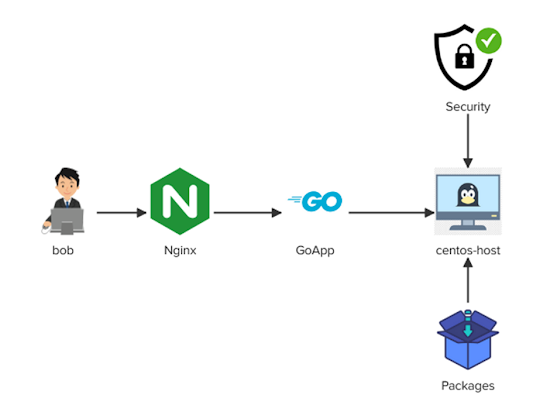

#### Task 2 - The app server called centos-host is running a Go app on the 8081 port. You have been asked to troubleshoot some issues with yum/dnf on this system, Install Nginx server, configure Nginx as a reverse proxy for this Go app, install firewalld package and then configure some firewall rules.

---
##### 1. At first  switch to root user and Troubleshoot the issues with "yum/dnf" and make sure you are able to install the packages on *"centos-host"*
`# yum install -y nginx`

##### 2. Above error we get  regards to DNS resolution unable to use Yum while install a pacakge
###### To resolve the issue we need to add  Google nameserver as the first line in the file and save
`# cat /etc/resolv.conf`
###### nameserver 8.8.8.8

##### 3. Install "nginx"  &   "firewalld" package
`# yum install -y nginx`
`# yum install -y firewalld`

##### 4. Start and Enable "firewalld" service
###### Add firewall rules to allow only incoming port "22", "80" and "8081".
###### The firewall rules must be permanent and effective immediately.
`# systemctl enable firewalld`
`# systemctl start firewalld`
`# systemctl status  firewalld`
`# firewall-cmd --zone=public --add-port=80/tcp --permanent`
`# firewall-cmd --zone=public --add-port=8081/tcp --permanent`
`# firewall-cmd --zone=public --add-port=22/tcp --permanent`
`# firewall-cmd --reload`
`# firewall-cmd --list-all`

##### 5. Start GoApp by running the "nohup go run main.go &" command from "/home/bob/go-app/" directory
`# pushd /home/bob/go-app`
`# nohup go run main.go &`
`# ps -ef |grep 39823`

##### 6. Configure Nginx as a reverse proxy for the GoApp so that we can access the GoApp on port "80
###### Start and Enable "nginx" service.
`# cat /etc/nginx/nginx.conf |grep proxy`
###### proxy_pass  http://localhost:8081;
`# nginx -t`
###### nginx: the configuration file /etc/nginx/nginx.conf syntax is ok
###### nginx: configuration file /etc/nginx/nginx.conf test is successful
`# systemctl enable nginx`
`# systemctl start nginx`
`# systemctl status  nginx`

##### 7. Validate by curl or Click the GoApp button above the terminal. You should get a login screen.
`# curl -u test:test http://localhost:80` 
